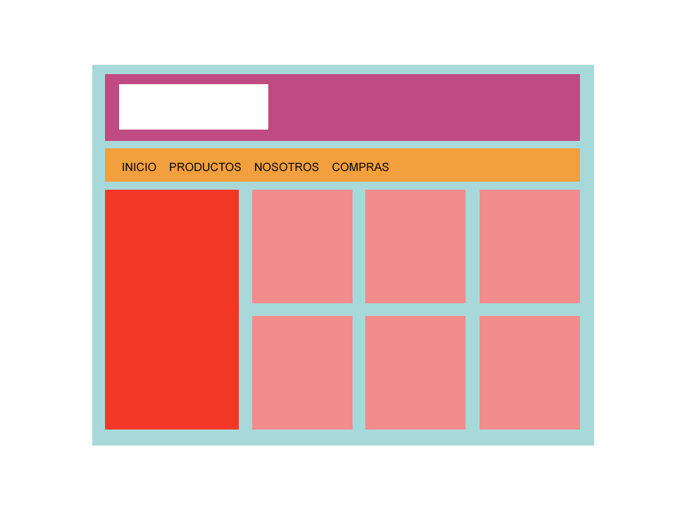

# lyracons - Frontend Test
## Ejercicios
1) Maquetar el archivo adjunto 'boceto_frontend.jpg' utilizando un archivo HTML y otro CSS.

2) Agregar al menú del ejercicio anterior un menú desplegable en 'Productos' con los sub ítems "Pantalones, Remeras, Camperas" (sin utilizar JavaScript).
3) Agregar JavaScript al ejercicio anterior para que suceda lo siguiente:
    1) Al hacer click en el botón 'Inicio', desaparezcan todos los ítems del contenido.
    2) Al hacer over en el botón 'Compras', cambie de color el sidebar, y al hacer mouseout vuelva al color original.
    3) Al hacer click en el botón 'Nosotros' se agregue al sidebar el texto 'Hola Mundo!'.
4) Generar el submenú para el botón 'Productos' iterando los datos en el siguiente array PHP:
```php
$sub_menu = array(
       array(
           'titulo' => 'Ropa',
           'url' => '/ropa.html'
       ),
       array(
           'titulo' => 'Electronica',
           'url' => '/electronica.html'
       ),
       array(
           'titulo' => 'Higiene',
           'url' => '/higiene.html'
       ),
       array(
           'titulo' => 'Alimentos',
           'url' => '/alimentos.html'
       ),
       array(
           'titulo' => 'Otros',
           'url' => '/otros.html'
       )
   );
```
5) Generar el mismo submenú, pero esta vez en JavaScript utilizando los datos del siguiente JSON:
```javascript
const JSON = {
    submenu: [
        {
            titulo: 'Ropa',
            url: './ropa.html'
        },
        {
            titulo: 'Electronica',
            url: './electronica.html'
        },
        {
            titulo: 'Higiene',
            url: './higiene.html'
        },
        {
            titulo: 'Alimentos',
            url: './alimentos.html'
        },
        {
            titulo: 'Otros',
            url: './otros.html'
        }
    ]
}
```